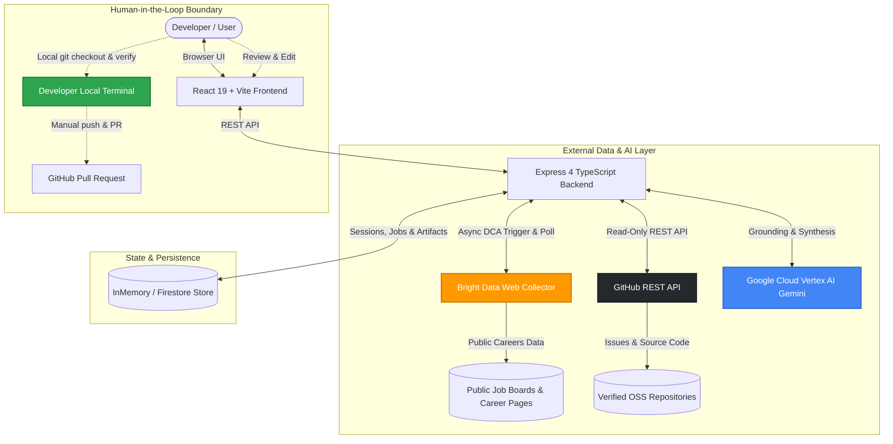
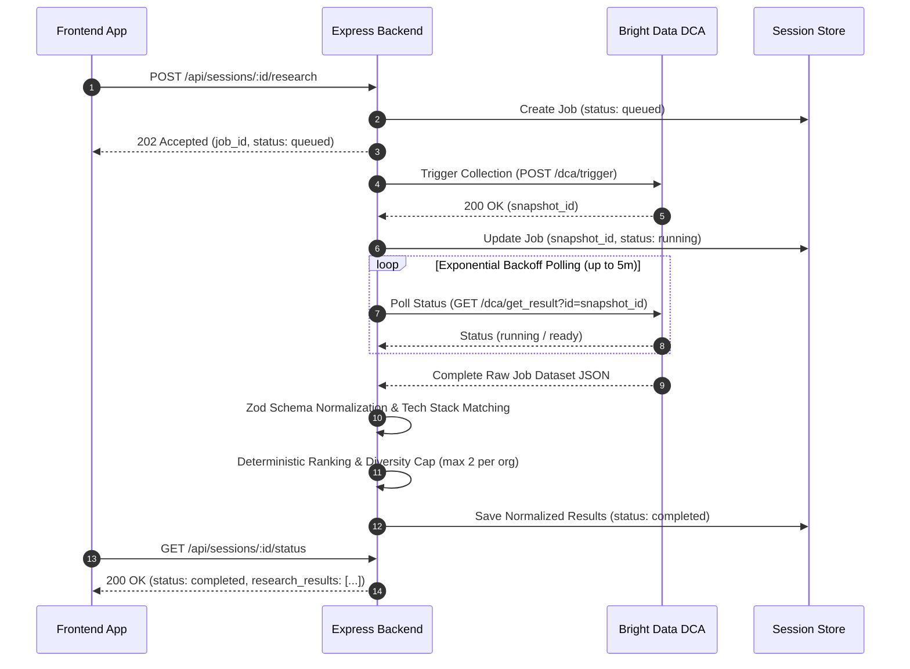

# Web-Slinger

> **Turn live market demand into verified open-source contributions — with Bright Data intelligence and human-in-the-loop safety.**

[](https://www.typescriptlang.org/)
[](https://react.dev/)
[](https://vitejs.dev/)
[](https://expressjs.com/)
[](https://brightdata.com/)
[](https://cloud.google.com/vertex-ai)
[](LICENSE)

🌐 **Live Application**: [https://web-slinger-506212.web.app](https://web-slinger-506212.web.app)  
⚡ **API Health Status**: [https://web-slinger-506212.web.app/api/healthz](https://web-slinger-506212.web.app/api/healthz)

---

<!-- Add demo GIF here before submission -->

## Table of Contents
- [Why Web-Slinger?](#why-web-slinger)
- [The Proof Flow](#the-proof-flow)
- [Architecture](#architecture)
- [Bright Data: Live Public Opportunity Research](#bright-data-live-public-opportunity-research)
- [Trust Boundaries](#trust-boundaries)
- [Key Capabilities](#key-capabilities)
- [Repository Structure](#repository-structure)
- [Run Locally](#run-locally)
- [Data Modes and Reliability](#data-modes-and-reliability)
- [Deployment Architecture](#deployment-architecture)
- [Demo Walkthrough](#demo-walkthrough)
- [Roadmap](#roadmap)
- [Security and Privacy](#security-and-privacy)

---

## Why Web-Slinger?

Developers want to contribute meaningfully to open source, but finding the right issue is often disconnected from real-world industry demand. Meanwhile, engineering teams publish detailed job requirements and maintain open-source ecosystems, but connecting the dots between hiring signals and candidate issues requires hours of manual research.

**Web-Slinger closes the job-to-contribution gap:**
1. **Discovers** what top engineering teams (e.g., Cloudflare, Sentry, Grafana Labs) are actively building using live public hiring data.
2. **Grounds** candidate issues from verified open-source repositories against real market context.
3. **Assists** the developer through understanding, planning, drafting, and verifying patches — without ever making automated commits, pushes, or pull requests.

---

## The Proof Flow

Web-Slinger structures the developer workflow into five disciplined, human-in-the-loop stages:

```
[ 1. Discover ] ──► [ 2. Choose ] ──► [ 3. Understand ] ──► [ 4. Draft ] ──► [ 5. Verify ]
  Stack & Goal        Target Role &      Source-Grounded       Plan & Patch       Proof Receipt &
   Selection           Company Repo       Context Brief           Editor          Manual Handoff
```

1. **Discover**: Select target technologies (e.g., `TypeScript`, `React`, `Go`, `Node.js`) and an optional contribution focus.
2. **Choose**: Select from ranked, evidence-grounded opportunities matching your stack, then choose an official company repository.
3. **Understand**: Read a source-grounded context brief with exact reproduction instructions, affected code locations, and verified requirements.
4. **Draft**: Inspect an AI-generated structured work plan and unified diff patch in an editable workbench.
5. **Verify**: Record deterministic local test execution outcomes, generate an immutable JSON Proof Receipt, and obtain copy-paste instructions for your own branch and pull request.

---

## Architecture

Bright Data serves as the external intelligence engine, collecting live engineering opportunities that ground the entire downstream AI drafting and verification lifecycle.



---

## Bright Data: Live Public Opportunity Research

Bright Data powers Web-Slinger's live market discovery. Rather than relying on static or synthetic job lists, Web-Slinger queries live public career listings using Bright Data's Data Collector Architecture (DCA).



<details>
<summary><strong>Deep Dive: Bright Data Normalization & Resilient Failure Handling</strong></summary>

### 1. Robust Schema Normalization
Every returned job listing is parsed through strict Zod validation (`NormalizedJobResultSchema`). Required fields include:
- `company_name`: Identified organization (e.g., Cloudflare, Sentry, Grafana Labs)
- `role_title`: Standardized engineering position title
- `source_url`: Real, verifiable source URL to the original listing
- `collected_at`: ISO timestamp of collection
- `candidate_repositories`: Official open-source repositories associated with the employer

### 2. Deterministic Diversity Ranking
To prevent a single employer from dominating results, Web-Slinger enforces a diversity filter:
- Ranks candidates by matching technology stack keywords against job titles and descriptions.
- Caps opportunities at **top 5 total**, with a maximum of **2 positions per company**.

### 3. Truthful Degraded State Handling
Public job collection can be delayed by upstream network timeouts or dynamic changes to career sites. When a source times out or returns zero listings:
- The system **never fabricates synthetic job listings** in live mode.
- The session is safely preserved in storage.
- The UI renders a calm, truthful status: *"Live job research could not finish for this source. Try another source or return later."*
- Any successfully retrieved records from other sources are preserved.

</details>

---

## Trust Boundaries

Web-Slinger maintains strict trust boundaries so developers and maintainers retain complete control:

| System / Actor | Allowed Actions | Strictly Prohibited Actions |
| :--- | :--- | :--- |
| **Bright Data Layer** | Read-only async discovery of public job listings; rate-limit aware polling. | Scraping private intranet listings; submitting applicant data. |
| **GitHub Integration** | Read-only fetching of public repository issues, file trees, and file contents. | Writing files, pushing commits, opening PRs, modifying issue labels. |
| **Vertex AI (Gemini)** | Generating context briefs, structured work plans, and unified diff drafts. | Executing code, bypassing validation, fabricating citations. |
| **Developer (Human)** | Approves opportunities, reviews diffs, runs local tests, submits PR manually. | N/A — Developer has absolute authority over final submission. |

---

## Key Capabilities

- **Evidence-First Opportunity Discovery**: Live public job listings linked directly to verified open-source repositories.
- **Source-Grounded Context Briefs**: Structured synthesis of issue requirements with exact file pointers, reproduction steps, and constraints.
- **Interactive Patch Workbench**: Unified diff viewer and editor with live syntax highlighting and change limits (max 3 files, 120 lines).
- **Proof Receipts**: Verifiable, cryptographically structured JSON records containing test commands, execution timestamps, diff hashes, and readiness checklists.
- **Manual Handoff Mode**: Ready-to-use terminal commands (`git checkout`, `git apply`, `npm test`) and pull-request descriptions formatted for GitHub.
- **Calm Paper-Like UI**: Focused decision canvas featuring a responsive max-width content rail and high-contrast, distraction-free typography.

---

## Repository Structure

```
web-slinger/
├── backend/                  # Express.js REST API with TypeScript
│   ├── src/
│   │   ├── config.ts         # Environment validation and startup logging
│   │   ├── routes/           # Session, research, issues, brief, and patch endpoints
│   │   ├── repositories/     # InMemory & Firestore abstraction layer
│   │   └── services/         # Bright Data DCA, GitHub API, Gemini & Greenhouse adapters
│   └── tests/                # Vitest unit and integration test suites (15 suites)
├── frontend/                 # React 19 + Vite + TypeScript application
│   ├── src/
│   │   ├── api/              # Strongly-typed HTTP client bindings
│   │   ├── components/       # Canvas views (Discover, Choose, Understand, Draft, Verify)
│   │   └── index.css         # Global design system tokens and responsive layout
│   └── tests/                # React Testing Library component tests (14 suites)
├── shared/                   # Shared TypeScript schemas, contracts, and utilities
│   ├── src/schemas/          # Zod schemas for sessions, jobs, issues, briefs, patches, proofs
│   └── src/utils/            # Diversity ranking, company catalog, and date helpers
└── docs/                     # Architecture specifications and implementation records
```

---

## Run Locally

### Prerequisites
- **Node.js** >= 20.x
- **pnpm** >= 9.x

### 1. Clone and Install Dependencies
```bash
git clone https://github.com/Gauravsharma2711/web-slinger.git
cd web-slinger
pnpm install
```

### 2. Configure Environment Variables
Copy `.env.example` in the backend workspace to `.env`:
```bash
cp backend/.env.example backend/.env
```

Edit `backend/.env` with your credentials:
```ini
PORT=8080

# Google Cloud Vertex AI (Optional for AI generation)
GOOGLE_CLOUD_PROJECT=your-project-id
GOOGLE_CLOUD_LOCATION=global
GEMINI_MODEL_ID=gemini-3.7-flash
GEMINI_THINKING_LEVEL=LOW

# Bright Data DCA (Optional for live job collection)
BRIGHT_DATA_API_TOKEN=your-bright-data-api-token
BRIGHT_DATA_JOB_COLLECTOR_ID=your-collector-id
RESEARCH_SEED_URLS=https://careers.oracle.com/en/sites/jobsearch/jobs

# GitHub API Token (Optional — increases rate limits)
GITHUB_TOKEN=your-github-personal-access-token
GITHUB_TARGET_OWNER=freeCodeCamp
GITHUB_TARGET_REPO=freeCodeCamp

# Application Behavior
DEMO_MODE=false
```

<details>
<summary><strong>Environment Configuration Reference (.env.example)</strong></summary>

```ini
PORT=8080
GOOGLE_CLOUD_PROJECT=
GOOGLE_CLOUD_LOCATION=global
GEMINI_MODEL_ID=gemini-3.7-flash
GEMINI_THINKING_LEVEL=LOW
BRIGHT_DATA_API_TOKEN=
BRIGHT_DATA_JOB_COLLECTOR_ID=
RESEARCH_SEED_URLS=
DEMO_MODE=false
```

</details>

### 3. Start Development Servers
Run both backend and frontend concurrently:
```bash
pnpm dev
```
- **Frontend**: `http://localhost:5173`
- **Backend API**: `http://localhost:8080`

### 4. Build and Quality Checks
```bash
# Type check all workspaces
pnpm typecheck

# Lint all workspaces
pnpm lint

# Run all 35 test suites (266 unit & integration tests)
pnpm test

# Build production bundles
pnpm build
```

---

## Data Modes and Reliability

<details>
<summary><strong>Expand to view details on Live Mode, Demo Mode, and Fault Tolerance</strong></summary>

Web-Slinger supports two distinct operational modes:

### 1. Live Data Mode (`DEMO_MODE=false`)
- **Default Production Mode**.
- Queries live public sources via Bright Data or configured read-only adapters (e.g. Grafana Labs Greenhouse public API).
- Opportunities are displayed only if they possess verifiable source URLs and live collection timestamps.
- If upstream collection times out, the system degrades truthfully without inventing synthetic job records.

### 2. Demo Mode (`DEMO_MODE=true` or `?demo=true`)
- Provides deterministic, offline evaluation for judges and reviewers without requiring live external API keys.
- Curated opportunities across Cloudflare, Sentry, and Grafana Labs are returned immediately.
- **Explicit Provenance**: Every demo card and issue displays the notice: `Demo sample — not a live job listing`.

</details>

---

## Deployment Architecture

- **Frontend**: Deployed on **Firebase Hosting** with global CDN caching: [https://web-slinger-506212.web.app](https://web-slinger-506212.web.app)
- **Backend**: Containerized Express application deployed to **Google Cloud Run** (`us-central1`): [https://web-slinger-api-gvjkcjg3fq-uc.a.run.app](https://web-slinger-api-gvjkcjg3fq-uc.a.run.app)
- **Persistence**: **Google Cloud Firestore** storage (`web-slinger-506212`) for distributed session tracking.
- **AI Acceleration**: Managed **Vertex AI Gemini 3.7 Flash** for source-grounded context brief and patch generation.

---

## Demo Walkthrough

1. **Discover**: Launch the app at `http://localhost:5173/`. Choose `TypeScript` and `React` chips and click **Find opportunities**.
2. **Choose**: Inspect the ranked engineering positions. Filter by company (e.g., *Cloudflare*, *Sentry*, *Grafana Labs*). Select an opportunity and click **Choose a verified repository**.
3. **Understand**: Select an open candidate issue (e.g., good first issue). Read the synthesized **Context Brief** detailing technical requirements and affected code paths.
4. **Draft**: Review the generated **Work Plan** and editable **Patch Draft** diff.
5. **Verify**: Check off verification steps, generate the **Proof Receipt**, and copy the manual handoff commands to test and submit on GitHub.

---

## Roadmap

- [ ] **Multi-Board Adapters**: Expand direct adapters for Greenhouse, Lever, and Workday to complement Bright Data DCA web crawling.
- [ ] **Automated GitHub Test Runner**: Execute sandbox container tests on generated patches before presenting verification proofs.
- [ ] **Custom Repository Mapping**: Allow users to link their own private GitHub organizations to corporate career listings.

---

## Security and Privacy

- **Server-Side Credentials**: All API tokens (Bright Data, GitHub, Google Cloud) remain exclusively on the server and are never sent to the browser client.
- **Read-Only Scope**: Web-Slinger operates entirely read-only against external repositories and APIs. It possesses no write permissions to any GitHub repository.
- **Local Developer Execution**: Patch files and Git commands are executed manually on the developer's local machine, guaranteeing full human oversight.

---

<div align="center">
  <sub>Built with care for the 2026 Developer Tooling Hackathon. Evidence-first open-source contribution.</sub>
</div>
