# Day 4 Block 3: Calm Web-Slinger Workbench UI Walkthrough

## Summary
Implemented **Day 4, Block 3** for Web-Slinger: a calm, evidence-grounded workbench interface encompassing Work Plan, Source Review, Patch Review, and Verification Prep.

The workbench adheres to the **Calm Proof Flow** design philosophy: one shared content rail, generous whitespace, dotted canvas background, no sidebar or complex dashboard shell, and zero horizontal overflow across all desktop and mobile viewports.

---

## 1. Day 4 Workbench Architecture & Step Flow

```mermaid
flowchart LR
    Brief[Context Brief Canvas] -->|I have read this — open workbench| Step1[1. Work Plan]
    Step1 -->|Proceed to source review| Step2[2. Source Review]
    Step2 -->|Affirmation + Checkboxes -> Generate Patch| Step3[3. Patch Review]
    Step3 -->|Proceed to verification prep| Step4[4. Verification Prep]
    Step4 -->|Copy checklist / New Session| Complete[Developer Tests Locally]
```

### The 4 Connected Workbench Steps

1. **Step 1: Work Plan (`plan`)**
   - Displays confirmed problem statement, candidate files with `CONFIRMED` / `CANDIDATE` confidence badges and evidence links, smallest change plan (ordered steps), risks and unknowns, recommended manual checks, and source citations.
   - Primary action: `Proceed to source review →`

2. **Step 2: Source Review (`sources`)**
   - Human-in-the-loop verification gate.
   - Displays all retrieved file evidence cards with path, ref, SHA, canonical `Open on GitHub ↗` links, and code preview excerpts.
   - Requires checking each retrieved source file checkbox (`I have opened and reviewed <path>`).
   - Requires checking the persistent affirmation declaration:
     *“I opened the cited sources and understand this is a draft. I will review, edit, and test any proposed change myself.”*
   - `Generate patch draft` is disabled until all checkboxes are checked.

3. **Step 3: Patch Review (`patch`)**
   - Persistent mandatory notice banner:
     *“Draft only. Web-Slinger has not modified a repository or run these changes. Read, edit, apply, and test the draft in your own local clone.”*
   - Changed files header (`1 changed file`, `2 changed lines`).
   - Warnings & validation status.
   - Monospace dark-mode styled unified diff editor (`textarea`), allowing developers to edit the draft in memory.
   - Action cluster:
     - `Save my edited draft` (calls `PUT` endpoint to persist changes to the session record)
     - `Copy patch` (copies diff to clipboard)
     - `Download .patch` (downloads `.patch` file for local application with `git apply`)
     - `Proceed to verification prep →`
   - **Zero forbidden action buttons**: No buttons named `Apply`, `Fix`, `Push`, `Commit`, `Submit`, or `Create pull request`.

4. **Step 4: Verification Prep (`verification`)**
   - Displays mandatory verification disclaimer:
     *“All checks must be performed manually by the developer. Web-Slinger does not execute local commands or evaluate test outcomes.”*
   - Manual checklist where every check item is strictly badged `NOT VERIFIED`.
   - Suggested terminal commands (e.g. `pnpm run test:curriculum`).
   - `Copy checklist` action to copy Markdown-formatted checklist to clipboard for local tracking.

---

## 2. All Day 4 Routes & Endpoints

### Frontend UI Views
- `EntryCanvas`: Stack input and session creation.
- `ResearchCanvas`: Bright Data live opportunity research.
- `IssuesCanvas`: Normalized, triaged candidate issues (Tier A / Tier B).
- `ContextBriefCanvas`: Source-grounded context brief with mandatory notice.
- `WorkbenchCanvas`:
  - `step: 'plan'`: Work Plan
  - `step: 'sources'`: Source Review Gating
  - `step: 'patch'`: Patch Review & In-Memory Editing
  - `step: 'verification'`: Verification Prep Manual Checklist

### Backend REST API Endpoints
- `POST /api/sessions/:sessionId/issues/:issueNumber/work-plan`
- `GET  /api/sessions/:sessionId/issues/:issueNumber/work-plan`
- `POST /api/sessions/:sessionId/issues/:issueNumber/patch-draft` (Requires `userAffirmation: true` and verified `{ path, sha }` matching)
- `GET  /api/sessions/:sessionId/issues/:issueNumber/patch-draft/:patchId`
- `PUT  /api/sessions/:sessionId/issues/:issueNumber/patch-draft/:patchId` (In-memory/Firestore edit only; zero disk/GitHub writes)
- `POST /api/sessions/:sessionId/issues/:issueNumber/verification-plan`

---

## 3. Work Intentionally Deferred to Day 5

To maintain strict human-in-the-loop integrity and avoid premature feature bloat, the following items are intentionally deferred to Day 5:
1. **Multi-File Interactive Side-by-Side Diff Viewer:** Side-by-side split visual diff with syntax highlighting per language (currently uses unified diff editor).
2. **Local Git Helper CLI Script / Export Package:** Optional developer CLI bundle to automate pulling verification checklists into local terminal workflows.
3. **Session Persistence & Export Archive (.zip / JSON):** Complete session export bundle with brief, work plan, patch, and checklist for offline archive.
4. **Enhanced Onboarding Telemetry / Feedback:** Optional developer rating and feedback on work plan and patch quality.

---

## 4. Verification & Quality Assurance

### Test Suites (168 Total Tests Passing)
- **`@web-slinger/shared`:** 37 passed
- **`@web-slinger/backend`:** 88 passed
- **`@web-slinger/frontend`:** 43 passed (including `WorkbenchCanvas.test.tsx` and multi-breakpoint `layout.test.tsx`)

### Responsive & Layout Validation
- Tested across **1920px (Desktop Wide)**, **1280px (Laptop Standard)**, **768px (Tablet)**, and **375px (Mobile)** viewports.
- Verified universal root overflow safety (`document.documentElement.scrollWidth <= document.documentElement.clientWidth`).
- Single shared content rail (`ws-content-rail`), zero `100vw` layout shifts.

### Lint & Build
- `pnpm -r run lint`: Clean with 0 warnings/errors.
- `pnpm -r run build`: Clean TypeScript compile and Vite production bundle.
